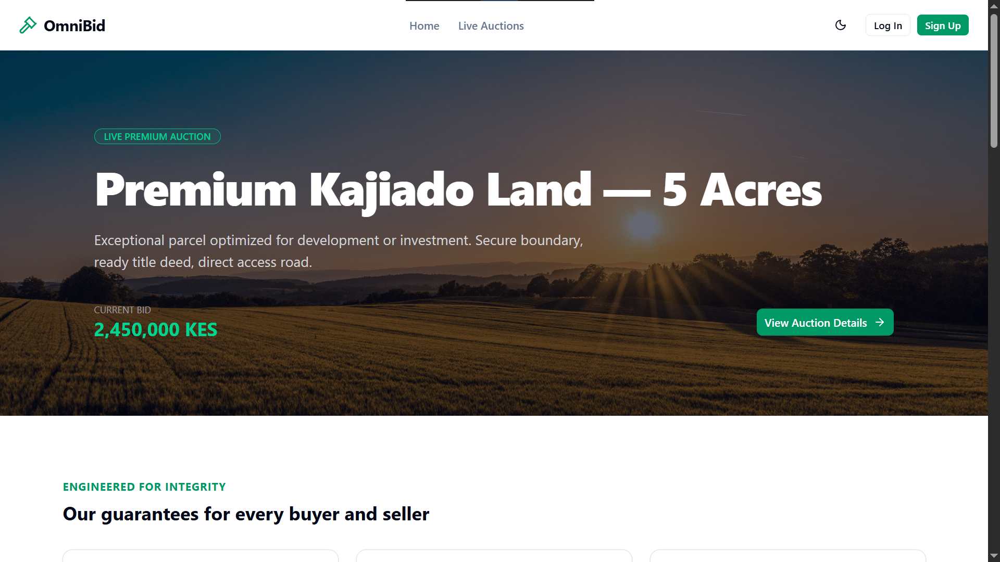
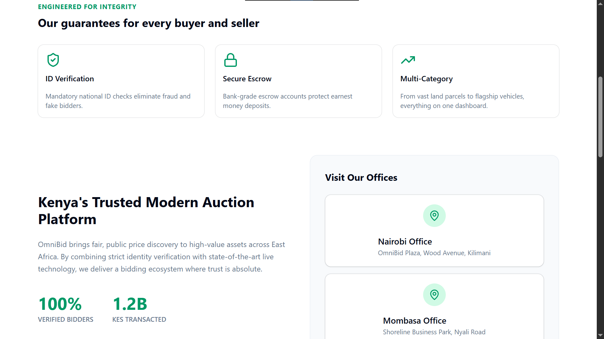
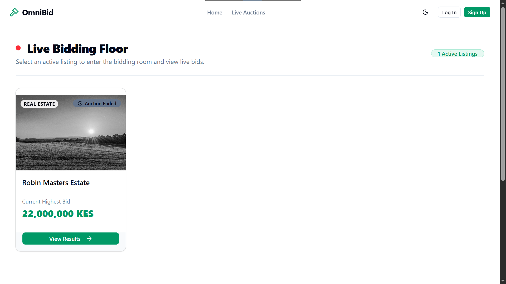

# OmniBid - Premier Kenyan Auction Platform

OmniBid is a real-time, secure, and transparent online auction platform tailored for the Kenyan market. Built using React, Vite, Tailwind CSS, and Firebase, the platform supports live bidding, role-based access control, Google authentication, secure escrow-backed checkouts, and dynamic PDF receipt generation.

---

## Platform Previews

### Landing Page

*Figure 1: The OmniBid landing page featuring clean typography, hero CTAs, and secure platform highlights.*

*Figure 2: The OmniBid landing page featuring clean typography, hero CTAs, and secure platform highlights.*

### Live Bidding Floor

*Figure 3: The live bidding floor showcasing real-time countdown timers, asset categories, and active bidding cards.*

---

## Key Features

* **Real-Time Live Bidding Floor**: Watch live countdown timers and track real-time competitive bids placed by other participants.
* **Secure Authentication**: Instant login and registration using Google Auth or standard email/password.
* **Fraud Prevention & Identity Verification**: Integrated National ID validation checks before users can participate on the active bidding floor.
* **Locked-Price Checkout**: Automated checkout flow that binds directly to the asset's final winning bid price, capturing M-Pesa or bank reference codes.
* **Dynamic PDF Receipts**: Generates official transaction receipts instantly upon successful checkout using `jsPDF`.
* **Comprehensive Admin Dashboard**: Secure management tools for publishing/deleting auctions, monitoring users, and visualizing platform revenue trends via Recharts.

---

## Figma Design
The UI/UX for this project was carefully prototyped and designed in Figma prior to development. 

**[View the full OmniBid Figma Design Prototype Here](https://www.figma.com/design/zvv1hqafK5SX29sp5JZ8Vj/Omni-Bid?node-id=3-10&t=pCoG2rTQGPSa1wNq-1)**

---

## Tech Stack

* **Frontend**: React, Vite, React Router, Tailwind CSS, Lucide Icons, Recharts, Sonner (Toast notifications)
* **Backend & Database**: Firebase Authentication, Cloud Firestore (Real-time collections), Firebase Storage
* **Document Generation**: `jsPDF`

---

## Installation & Setup

To run this project locally, ensure you have Node.js and Git installed. First, clone the repository (`git clone https://github.com/lameckkipsang/omni-bid.git`) and navigate into the project directory (`cd omnibid`). 

* **Install Dependencies:** Run `npm install` to install all required packages.
* **Configure Environment Variables:** Create a new file named `.env` in the root directory of the project and add your Firebase credentials:
  ```env
  VITE_FIREBASE_API_KEY="your_api_key_here"
  VITE_FIREBASE_AUTH_DOMAIN="your_auth_domain_here"
  VITE_FIREBASE_PROJECT_ID="your_project_id_here"
  VITE_FIREBASE_STORAGE_BUCKET="your_storage_bucket_here"
  VITE_FIREBASE_MESSAGING_SENDER_ID="your_messaging_sender_id_here"
  VITE_FIREBASE_APP_ID="your_app_id_here"

* **Start the Development Server:** Run npm run dev and navigate to http://localhost:5173 in your browser to view the application.
## Project Structure

```text
omnibid/
├── public/              # Static assets
├── src/
│   ├── assets/          # Images, banners, and preview screenshots
│   ├── components/      # Reusable UI components (shadcn/ui elements)
│   ├── lib/             # Firebase configuration and utility initializers
│   ├── pages/           # Main route views (Landing, LiveBidding, Admin, Login, etc.)
│   ├── App.jsx          # Root routing configuration
│   └── main.jsx         # Application entry point
├── .env                 # Environment variables (Git-ignored)
├── package.json         # Project dependencies and scripts
└── README.md            # Project documentation
```
## Deployment

To build the application for production deployment (e.g., Vercel, Netlify, or Firebase Hosting):

```bash
npm run build
